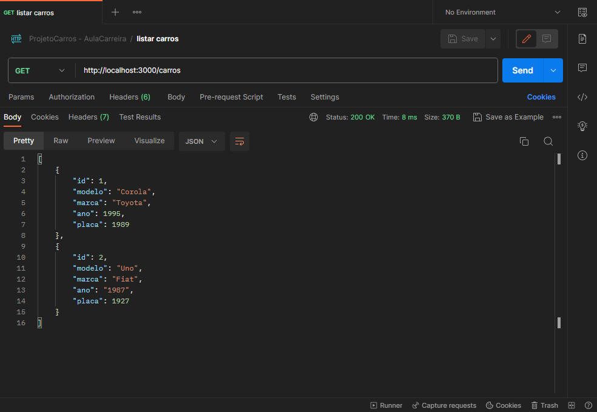
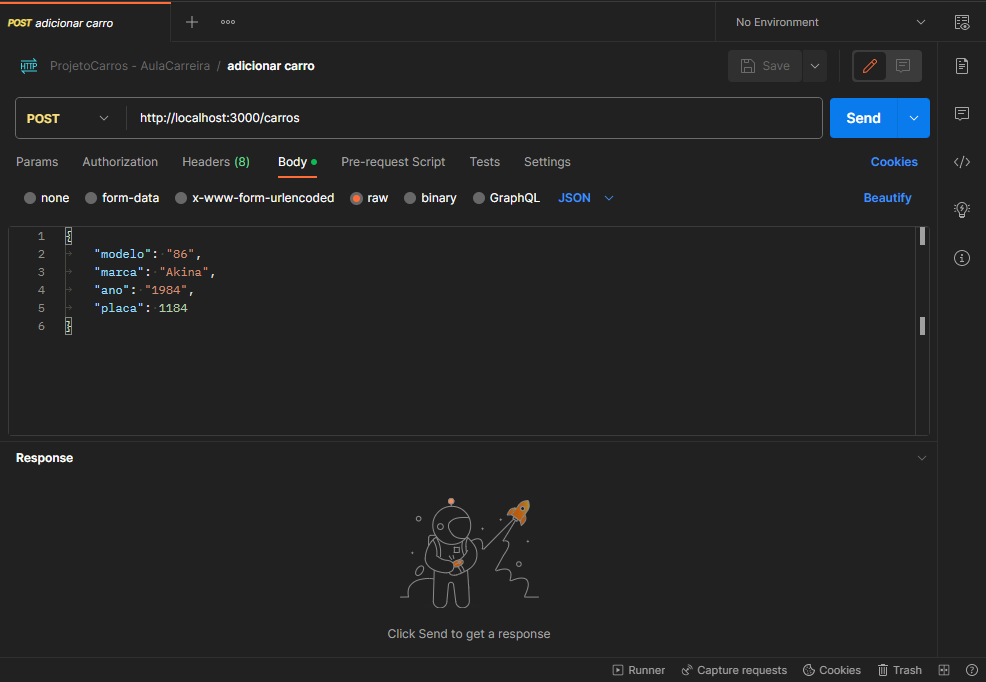
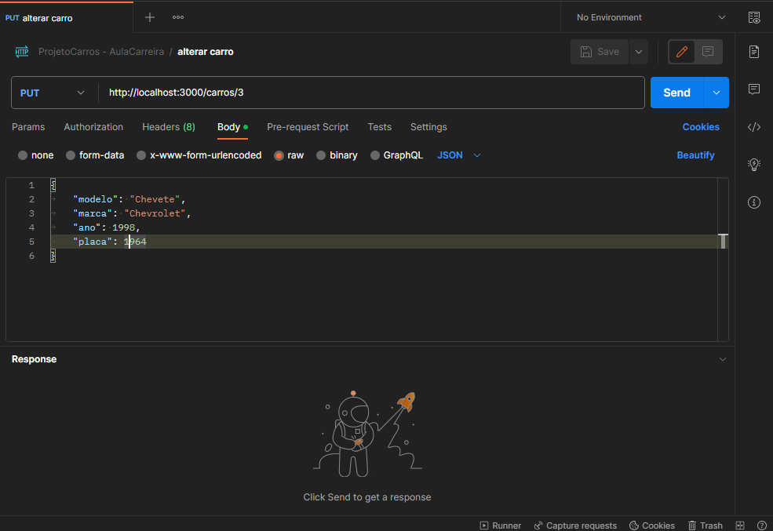
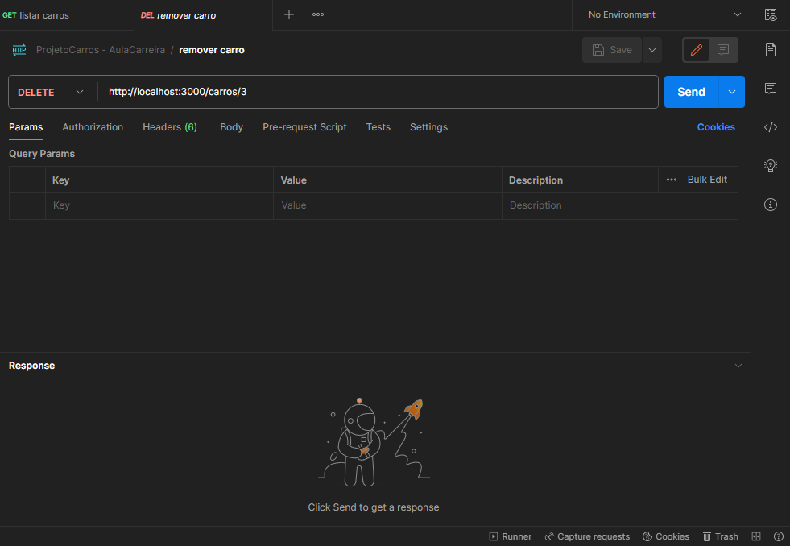

## Gerenciador de Carros Online

Este projeto foi relaizado com o intiuto de treinar os conceitos de CRUD em conjunto com a criação de APIs, este projeto segue o modelo REST e tem como propósito gerenciar uma coleção de carros dos mais váriados tipos, o usuário deve acessar os endPoints de algum Browser ou software própio para consumo de APIs, o que foi otilizado na realização deste projeto (e recomendado a ser usado) é o **Postman** que pode ser baixado nesse link: [`https://www.postman.com/`]

os links podem ser acessados via navegador também caso seja necessário.

a aplicação está configurada para executar na porta 3000 do dispositivo ou seja ao tentar acesar os links deve sempre ser passada como base a segunte URL: **`http://localhost:3000`**

requisitos para rodar o projeto:
- Git
- Node

comandos para executar o projeto
- **npm instal**
- **npm run dev**

## instruções para rodar o projeto
para utilizar esse projeto, primeiro faça o clone dele clicando no botão verde do GitHub `code`, copie a URl do projeto da maneira que preferir (https ou ssh) e depois no seu dispositivo em um diretório/pasta de sua preferencia e use o terminal do git para dar o comando git clone e a URL do projeto. Após isso no terminal (ainda do Git ou de outro de sua prefeerencia) execute o comando npm install e depois o comando npm run dev

- **listar todos os carros**

esse é um exemplo de como usar o método listar para visualizar todos os carros guardados no momento, como é apenas listagem e nenhum parametro é passado na URL nem no body da requisição ele pode ser acessado diretamente.

- **inserir um novo carro**

Neste exemplo são passados dados no Body da requisição, este modelo é seguido no método de criar e o id acaba por ser atribuido automaticamente de maneira incremental, tendo em vista que é um valor que não pode se repetir.

- **alterar um carro**

ja nesse link um carro pode ser alterado, é necessário passar não só parametros no Body da requisição, como um parametro ID na URL, para que se possa identificar o carro a ser alterado.

- **deletar um carro**

esse é o link para a exclusão de um carro, nele só será passado o id do carro a ser excluido na URL da requisição.